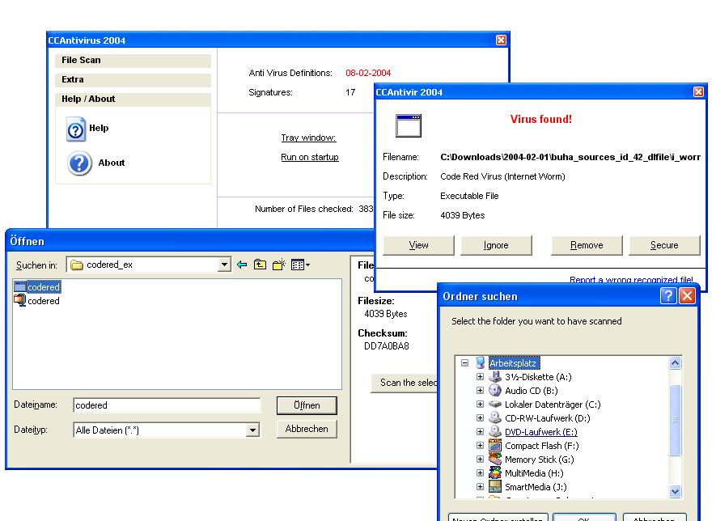



## Antivirus 2004 \(3\.0\)

### Description

CC Antivir 2004 - A complete working Anti Virus program

This is number three of my AntiVir prog. I got a lot of response to my last two submissions, many suggestions and tips.

Some of them are now realised: 1) ZIP File scanning 2) There's again the possibility to scan script Virii.

3) Bug / Virus Report is now possible 4) The code is changed to scan only dangerous files that means the Engine is very very fast (the 150MB (~700 Files) are now checked within 6 seconds (old engine: 35s))! 5) The Signature contains now 17 entries. 6) Quarintine Window over-worked (+Delete function) 7) Log functionality added

Note: The zip file support requires the "unzip.dll" in your System32 Directory. This is the ZIP Dll by the Info-Zip Group (THX). If you don't have this on your system, please download and install it from  http://www.vbaccelerator.com/home/VB/Utilities/VBPZip/Info-ZIP_Unzip_DLL_(Renamed_vbuzip10_dll).zip - or use the inbuilt download mechanism.
 
### More Info
 

             |
---                |---
**Submitted On**   |2004-02-20 17:46:22
**By**             |[Cyber Chris](https://github.com/Planet-Source-Code/PSCIndex/blob/master/ByAuthor/cyber-chris.md)
**Level**          |Advanced
**User Rating**    |4.7 (117 globes from 25 users)
**Compatibility**  |VB 3\.0, VB 4\.0 \(16\-bit\), VB 4\.0 \(32\-bit\), VB 5\.0, VB 6\.0
**Category**       |[Complete Applications](https://github.com/Planet-Source-Code/PSCIndex/blob/master/ByCategory/complete-applications__1-27.md)
**World**          |[Visual Basic](https://github.com/Planet-Source-Code/PSCIndex/blob/master/ByWorld/visual-basic.md)
**Archive File**   |[Antivirus\_1711292202004\.zip](https://github.com/Planet-Source-Code/cyber-chris-antivirus-2004-3-0__1-51899/archive/master.zip)

